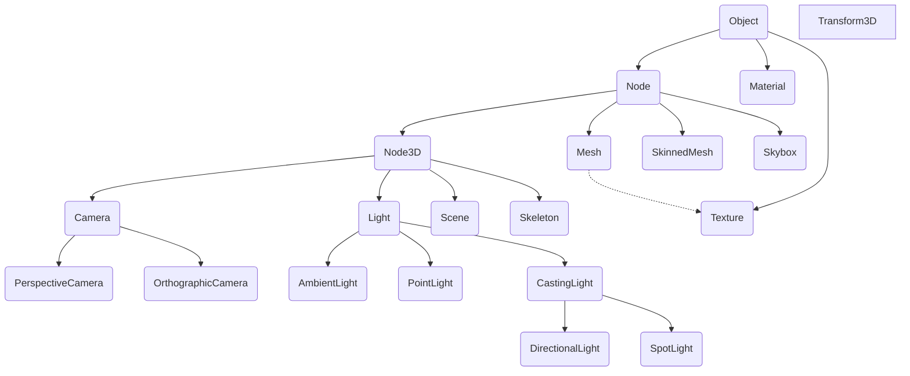

```mermaid
flowchart TD

O(Object)
T3D[Transform3D]

O --> N(Node)
N --> N3D(Node3D)
N3D --> Cam(Camera)
Cam --> CamP(PerspectiveCamera)
Cam --> CamO(OrthographicCamera)
N3D --> L(Light)
L --> LAmb(AmbientLight)
L --> LPnt(PointLight)
L --> LCst(CastingLight)
LCst --> LDir(DirectionalLight)
LCst --> LSpt(SpotLight)
N3D --> Scn(Scene)
N3D --> Skl(Skeleton)

N --> Msh(Mesh)
N --> Skm(SkinnedMesh)
N --> Skb(Skybox)

O --> Mat(Material)
O --> Tex(Texture)

Msh -.-> Tex
```
